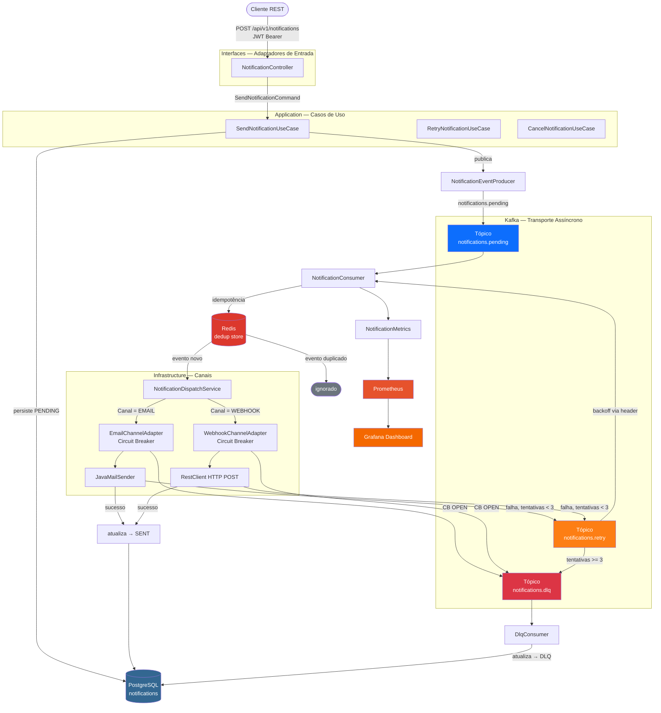

# notify-hub

> Plataforma de notificações assíncronas multi-canal orientada a eventos

[](https://openjdk.org/projects/jdk/21/)
[](https://spring.io/projects/spring-boot)
[](https://kafka.apache.org/)
[](https://redis.io/)
[](https://resilience4j.readme.io/)
[](https://www.postgresql.org/)
[](LICENSE)
[](https://github.com/seu-usuario/notify-hub/actions/workflows/ci.yml)

---

## O que é

O **notify-hub** é um hub centralizado para despacho de notificações assíncronas via múltiplos canais (e-mail, webhook). Clientes publicam via API REST e o sistema garante:

- **At-least-once delivery** com semântica idempotente
- **Deduplicação atômica** via Redis SETNX — sem processamento duplicado mesmo sob concorrência
- **Retry distribuído** com backoff exponencial via tópico Kafka dedicado
- **Circuit Breaker** por canal — falha em e-mail não impacta webhooks
- **Auditoria imutável** — histórico de transições de estado via trigger PostgreSQL
- **Observabilidade** — métricas Prometheus prontas + dashboard Grafana pré-provisionado

---

## Arquitetura

### Fluxo completo de uma notificação



### Camadas — Clean Architecture

```
domain/           → Aggregate Root, regras de negócio, ports (interfaces)
                    Zero dependências de framework
application/      → Orquestração de casos de uso, dispatch service
infrastructure/   → Kafka, JPA, Redis, canais (email/webhook), Resilience4j, métricas, JWT
interfaces/rest/  → Controllers, DTOs (records), mapper, OpenAPI
```

A dependência flui sempre de fora para dentro: `interfaces → application → domain`. A infraestrutura implementa as portas que o domínio define — nunca o contrário.

---

## Estrutura de Pastas

```
notify-hub/
├── src/
│   ├── main/java/tech/cuia/notifyhub/
│   │   ├── domain/
│   │   │   ├── model/           Notification.java · NotificationStatus · ChannelType
│   │   │   ├── port/in/         SendNotificationPort · GetNotificationPort · Retry · Cancel
│   │   │   ├── port/out/        NotificationRepository · EventPublisher · ChannelPort · Deduplication
│   │   │   └── exception/       NotificationNotFoundException · InvalidNotificationStateException
│   │   │                        NotificationDeliveryException · CircuitBreakerOpenException
│   │   ├── application/
│   │   │   ├── usecase/         Send · Get · Retry · Cancel
│   │   │   └── service/         NotificationDispatchService (sealed DispatchResult)
│   │   ├── infrastructure/
│   │   │   ├── channel/         email/ · webhook/
│   │   │   ├── kafka/           config/ · producer/ · consumer/
│   │   │   ├── persistence/     entity/ · repository/
│   │   │   ├── redis/           RedisDeduplicationAdapter
│   │   │   ├── resilience/      ResilienceConfig · HttpRetryPredicate
│   │   │   ├── metrics/         NotificationMetrics
│   │   │   └── security/        JwtTokenProvider · JwtAuthenticationFilter · SecurityConfig
│   │   └── interfaces/rest/
│   │       ├── controller/      NotificationController · AuthController · GlobalExceptionHandler
│   │       ├── dto/             request/ · response/
│   │       └── mapper/          NotificationMapper
│   ├── main/resources/
│   │   ├── application.yml          configuração base
│   │   ├── application-dev.yml      perfil dev (stubs, logs verbosos)
│   │   ├── application-prod.yml     perfil prod (TLS, logs mínimos)
│   │   └── db/migration/            V1 tabela principal · V2 auditoria + trigger
│   └── test/java/tech/cuia/notifyhub/
│       ├── domain/                  NotificationTest (8 casos, sem Spring)
│       ├── application/             SendNotificationUseCaseTest (Mockito)
│       └── infrastructure/
│           ├── kafka/               NotificationConsumerIntegrationTest (@EmbeddedKafka)
│           └── resilience/          CircuitBreakerTest (programático, sem Spring)
├── docker/
│   ├── grafana/provisioning/        datasources/ · dashboards/
│   └── prometheus/prometheus.yml
├── .github/workflows/ci.yml
├── docker-compose.yml
├── Dockerfile
└── pom.xml
```

---

## Decisões de Design

### Por que Kafka em vez de RabbitMQ?

| Critério | Kafka | RabbitMQ |
|---|---|---|
| Retenção de mensagens | Log imutável — replay via `--from-beginning` | Mensagem some após consumo |
| DLQ gerenciável | Tópico separado, replay trivial | Requer plugin `x-dead-letter-exchange` |
| Retry com delay | Header `retry-after` + tópico dedicado | Dead-lettering via TTL no broker |
| Consumer lag | Métrica nativa via JMX exporter | Menos granular |
| Escala horizontal | Particionamento nativo | Filas não particionam |

**Consequência:** para um hub que precisa de auditabilidade e replay de eventos históricos, Kafka é a escolha correta. RabbitMQ seria mais simples mas sacrificaria rastreabilidade.

### Por que Redis para deduplicação e não PostgreSQL?

A operação `SETNX notification:{id} 1 EX {ttl}` é atômica no Redis. Equivalente no PostgreSQL exigiria `SELECT FOR UPDATE` ou tratar `UniqueConstraintViolationException` — 10–50× mais lento, com risco de deadlock sob concorrência de partições Kafka.

### Por que Resilience4j e não Spring Retry?

Spring Retry só oferece retry. Resilience4j oferece Circuit Breaker (estados CLOSED/OPEN/HALF\_OPEN), Bulkhead (isolamento de thread pool), Métricas nativas via Micrometer e fallback tipado. Para isolar falhas entre canais independentes, CB é requisito, não opcional.

### Dual-level retry

| Nível | Mecanismo | Quando | Delay |
|---|---|---|---|
| 1 — Rápido | `@Retry` (Resilience4j) | Blip transitório de SMTP / rede | 300ms → 600ms |
| 2 — Distribuído | Tópico `notifications.retry` | Falha sustentada que sobrevive ao retry rápido | 1s → 2s → 4s (header) |

Quando o CB abre, `CircuitBreakerOpenException` (exceção de domínio) é capturada pelo `NotificationDispatchService` e roteia direto para DLQ sem consumir tentativas de retry.

---

## Execução Local

### Pré-requisitos

- Docker Engine 24+ e Docker Compose v2
- JDK 21 (apenas para desenvolvimento sem Docker)

### Subir toda a stack com um comando

```bash
git clone https://github.com/seu-usuario/notify-hub.git
cd notify-hub
docker compose up -d
```

Aguarde ~90 segundos para a aplicação passar o healthcheck. Acompanhe:

```bash
docker compose logs -f app
```

### URLs

| Serviço | URL | Credenciais |
|---|---|---|
| Swagger UI | http://localhost:8080/swagger-ui.html | JWT (ver abaixo) |
| Actuator Health | http://localhost:8080/actuator/health | — |
| Grafana | http://localhost:3000 | admin / admin |
| Prometheus | http://localhost:9090 | — |
| Kafka UI | http://localhost:8090 | — |
| MailHog (e-mails) | http://localhost:8025 | — |

### Desenvolvimento local (sem Docker)

```bash
# Sobe apenas as dependências (sem a app)
docker compose up -d postgres kafka zookeeper redis mailhog

# Roda a aplicação com perfil dev (DevMailStub, CB relaxado)
./mvnw spring-boot:run -Dspring-boot.run.profiles=dev
```

---

## Variáveis de Ambiente

| Variável | Padrão | Descrição |
|---|---|---|
| `DB_URL` | `jdbc:postgresql://localhost:5432/notifyhub` | JDBC URL do PostgreSQL |
| `DB_USER` | `notifyhub` | Usuário do banco |
| `DB_PASS` | `notifyhub` | Senha do banco |
| `KAFKA_SERVERS` | `localhost:9092` | Bootstrap servers do Kafka |
| `REDIS_HOST` | `localhost` | Host do Redis |
| `REDIS_PORT` | `6379` | Porta do Redis |
| `SMTP_HOST` | `localhost` | Host SMTP |
| `SMTP_PORT` | `1025` | Porta SMTP |
| `JWT_SECRET` | — | **Obrigatório em prod.** Mínimo 32 chars |
| `DEMO_CLIENT_ID` | `demo` | ID do cliente de demo |
| `DEMO_CLIENT_SECRET` | `demo-secret` | Segredo do cliente de demo |

---

## Exemplos de Uso (cURL)

**1. Autenticar**
```bash
TOKEN=$(curl -s -X POST http://localhost:8080/api/v1/auth/token \
  -H "Content-Type: application/json" \
  -d '{"clientId":"demo","clientSecret":"demo-secret"}' | jq -r .accessToken)
```

**2. Enviar notificação por e-mail**
```bash
curl -s -X POST http://localhost:8080/api/v1/notifications \
  -H "Authorization: Bearer $TOKEN" \
  -H "Content-Type: application/json" \
  -d '{
    "channel": "EMAIL",
    "recipient": "usuario@exemplo.com",
    "payload": {"subject": "Bem-vindo", "body": "Conta criada."},
    "idempotencyKey": "signup-user-42"
  }' | jq .
```

**3. Enviar webhook**
```bash
curl -s -X POST http://localhost:8080/api/v1/notifications \
  -H "Authorization: Bearer $TOKEN" \
  -H "Content-Type: application/json" \
  -d '{
    "channel": "WEBHOOK",
    "recipient": "https://webhook.site/seu-uuid",
    "payload": {"event": "ORDER_SHIPPED", "orderId": "ORD-9876"},
    "idempotencyKey": "order-shipped-9876"
  }' | jq .
```

**4. Consultar status**
```bash
curl -s "http://localhost:8080/api/v1/notifications/{id}" \
  -H "Authorization: Bearer $TOKEN" | jq .
```

**5. Reprocessar da DLQ**
```bash
curl -s -X POST "http://localhost:8080/api/v1/notifications/{id}/retry" \
  -H "Authorization: Bearer $TOKEN" | jq .
```

**6. Listar com filtros**
```bash
curl -s "http://localhost:8080/api/v1/notifications?status=FAILED&channel=EMAIL&page=0&size=20" \
  -H "Authorization: Bearer $TOKEN" | jq .
```

**7. Cancelar (apenas PENDING)**
```bash
curl -s -X DELETE "http://localhost:8080/api/v1/notifications/{id}" \
  -H "Authorization: Bearer $TOKEN" | jq .
```

---

## Testes

### Rodar a suíte completa

```bash
# Com dependências Docker subidas (postgres + redis):
./mvnw verify -Dspring.profiles.active=test

# Apenas testes de domínio e aplicação (sem infra):
./mvnw test -pl . -Dgroups="unit"
```

### Cobertura por camada

| Camada | Classe de Teste | Tipo | Foco |
|---|---|---|---|
| Domain | `NotificationTest` | Unitário puro | Máquina de estados, invariantes, imutabilidade |
| Application | `SendNotificationUseCaseTest` | Unitário + Mockito | Idempotência, happy path, duplicata |
| Infrastructure/Kafka | `NotificationConsumerIntegrationTest` | Integração `@EmbeddedKafka` | Pending→SENT, retry, DLQ, deduplicação |
| Infrastructure/CB | `CircuitBreakerTest` | Unitário programático | CLOSED→OPEN, HALF\_OPEN, exception ignorada |

### Estratégia de teste recomendada

```
Domínio     → JUnit 5 puro, zero Spring, zero Mockito
              Testa: criar, marcar como sent/failed, canRetry, canCancel, imutabilidade
                     do payload, igualdade por ID

Application → Mockito — moca Repository, Publisher, Channel
              Testa: idempotência via findByIdempotencyKey, fluxo retry, fluxo cancel

Infra/Kafka → @EmbeddedKafka — sem JPA, sem Redis reais
              Testa: consumer processa evento e chama dispatch, ack manual

Infra/CB    → CircuitBreakerRegistry programático
              Testa: transições de estado sem Spring overhead

REST        → @WebMvcTest + MockMvc — sem banco, sem Kafka
              Testa: status HTTP corretos, serialização JSON, autenticação

Integração  → @SpringBootTest + Testcontainers (postgres, redis, kafka)
              Testa: fluxo completo POST → Kafka → SENT atualizado no banco
```

---

## Métricas Expostas

| Métrica (Prometheus) | Tipo | Labels |
|---|---|---|
| `notify_hub_sent_total` | Counter | `channel` |
| `notify_hub_failed_total` | Counter | `channel`, `reason` |
| `notify_hub_latency_seconds` | Histogram | `channel` |
| `notify_hub_dlq_total` | Counter | `channel` |
| `resilience4j_circuitbreaker_state` | Gauge | `name`, `state` |

SLOs sugeridos no dashboard: **p99 < 5s**, **DLQ rate < 1%**, **CB nunca OPEN em prod**.

---

## CI/CD

O pipeline GitHub Actions (`.github/workflows/ci.yml`) executa em todo push para `main` e `develop`:

1. **test** — `mvn verify` com serviços Postgres + Redis reais (via `services:`)
2. **build-docker** — valida o Dockerfile com cache GHA (sem push)
3. **compose-validate** — `docker compose config --quiet` valida a sintaxe do compose

---

## Licença

MIT © 2026 — [Sebastian Nascimento](mailto:sebastiandevnascimento@gmail.com)
